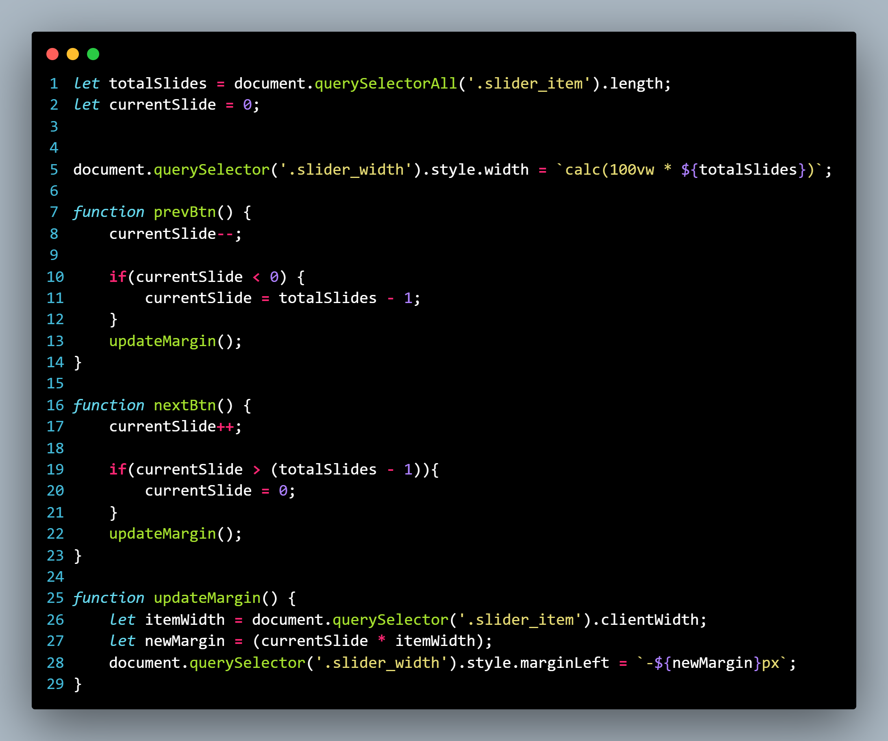

# ImageSlider
 
Um Container de imagens que possui dois botões, um para avançar a imagem, outro para retroceder.

---

## HTML

---
## CSS

---

## JavaScript

---

Feito em Conjunto com o professor [Bonieky Lacerda](https://www.youtube.com/c/BoniekyLacerdaLeal)

[Video no YouTube](https://www.youtube.com/watch?v=hF_VMWnsY00&t=3977s)

* Duração: 3h 32min
* Inicio do projeto em: [1h 56m](https://youtu.be/hF_VMWnsY00?t=7000)