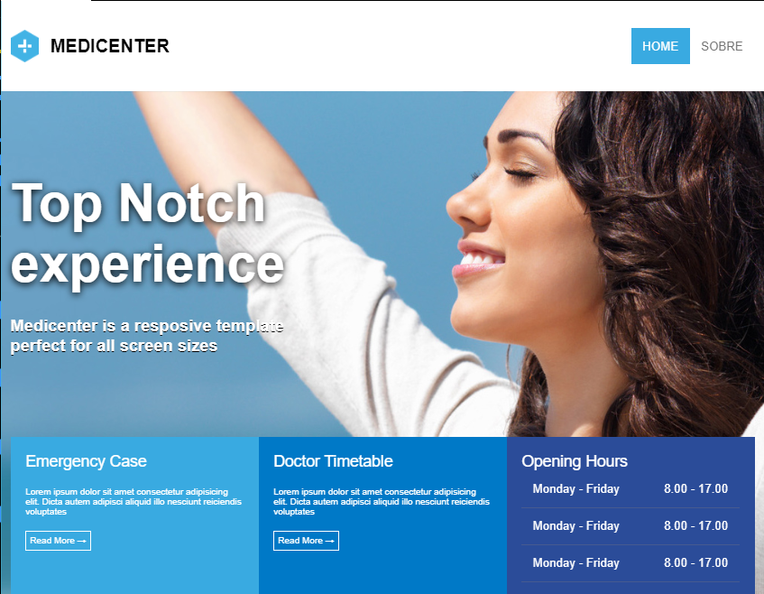
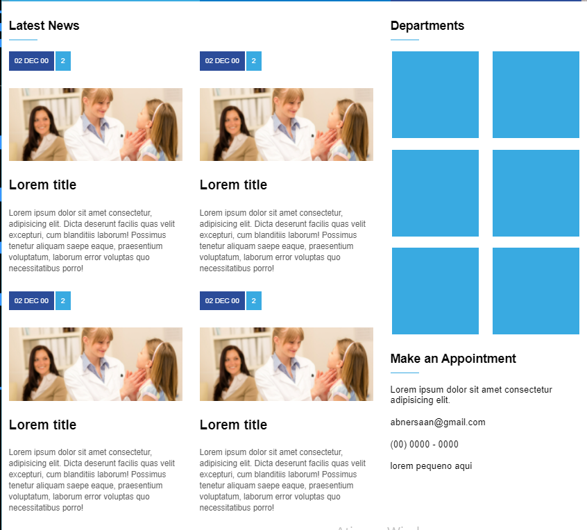
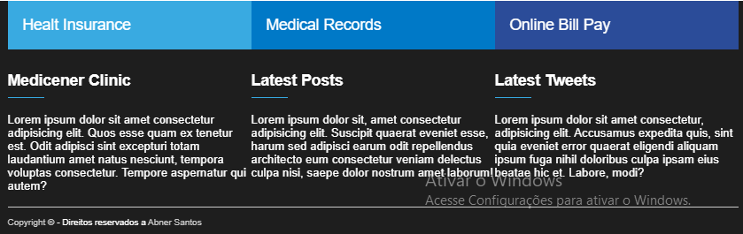

# Medicenter

Um Website sobre uma clinica médica feita com HTML e CSS para trainar as minas habilidades com Flexbox.

Feito com instruções do professor [Bonieky Lacerda](https://www.youtube.com/channel/UCw9mYSlqKRXI6l4vH-tAYpQ) em seu [curso gratuito](https://alunos.b7web.com.br/curso/html5-e-css3/projeto-site-com-flexbox-e-html-semantico-parte-1) de HTML e CSS.

---

